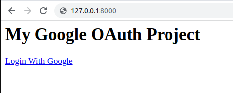
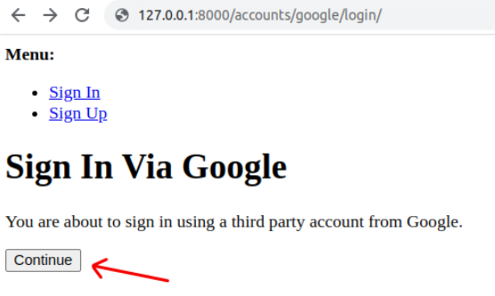
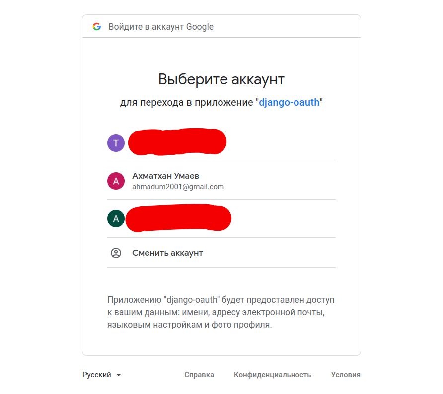
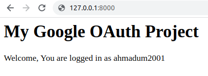

# User Registration in Django using Google OAuth
___
### To launch this application you need to:
1. Create virtual environment: Windows - `python -m venv venv` / Unix - `python3 -m venv venv`
2. Activate virtual environment: Windows - `.\venv\Scripts\activate` / Unix `source venv/bin/activate`
3. Install modules: `pip install -r requirements.txt`
4. Run server: `python manage.py runserver`
5. Open link: http://127.0.0.1:8000

 
 

### Click `continue`

### Select a Google account

### And that's it

### Source: https://www.section.io/engineering-education/django-google-oauth/